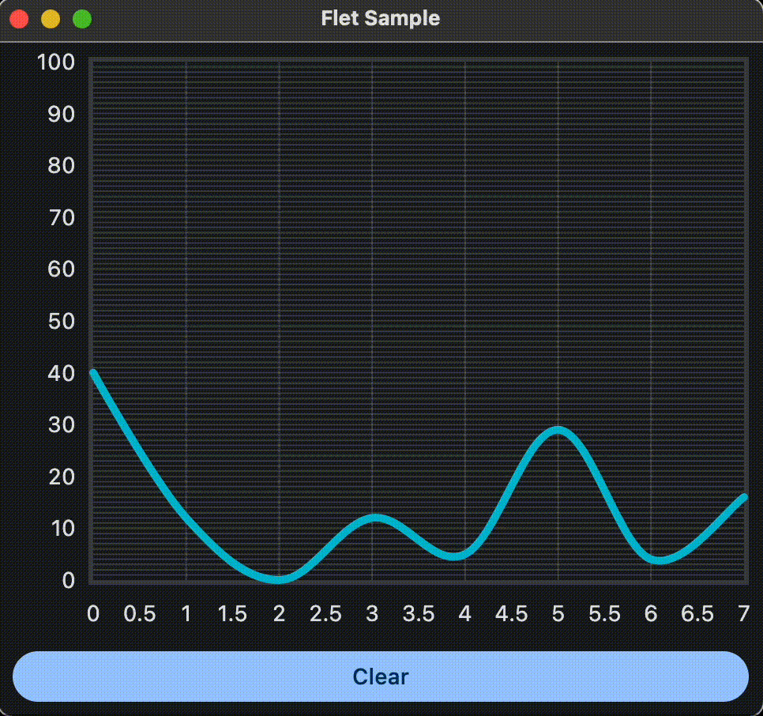

# FletSample
Fletを使用したアプリ開発(Mac/Raspberry Pi)<br>
CPU温度を取得してそれをチャートに表示します。<br>
クリアボタンをクリックで、チャートをクリアします。<br>

1. 作業ディレクトリ作成<br>
```sh
$ git clone https://github.com/taogya/FletSample.git
$ cd FletSample
```
2. 開発環境構築<br>
```sh
$ python3.9 -m venv venv
$ . venv/bin/activate
$ pip install -r requirements.txt
```
> [!NOTE]
> 以下のエラーが出た時は，追加パッケージのインストールが必要。
> flet: error while loading shared libraries: libmpv.so.1: cannot open shared object file: No such file or directory
> ```sh
> # Raspberry Pi4の場合です。
> $ sudo apt-get install -y mpv libmpv-dev
> $ sudo cp -r /usr/lib/aarch64-linux-gnu/libmpv.so.2 /usr/lib/aarch64-linux-gnu/libmpv.so.1
> ```
3. 実行<br>
GUIアプリとして起動<br>
```sh
$ cd src
$ python main.py
```
<br>

WEBアプリとして起動<br>
```sh
$ cd src
$ python main.py --host 0.0.0.0 --port 8080
```
http://localhost:8080<br>


## 自動起動設定
起動時に本アプリを起動したい場合は，以下の作業を行います。<br>
1. サービスファイルの作成<br>
    [こちら](flet_sample.service)参考にしてください。
2. サービスの起動
```sh
$ sudo systemctl link "$(pwd)"/flet_sample.service
$ sudo systemctl enable flet_sample
$ sudo systemctl start flet_sample
$ sudo systemctl status flet_sample
```